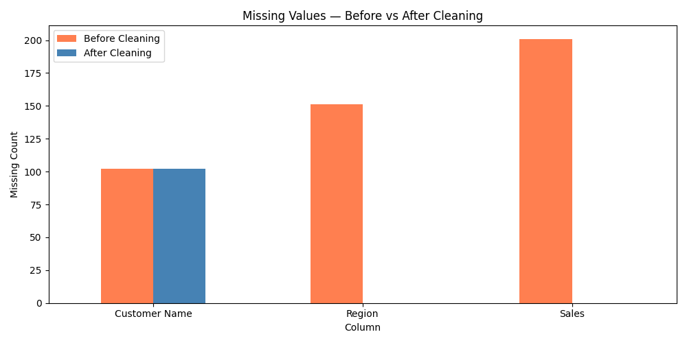
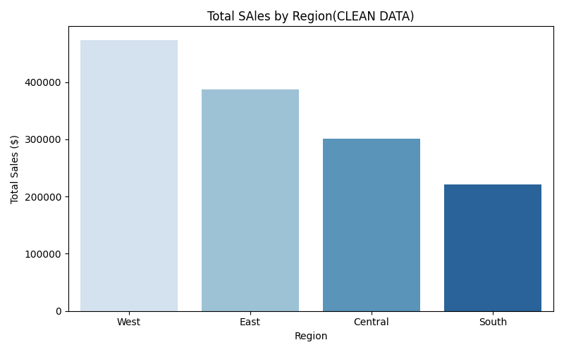

# Data Cleaning & Visualization Project 📊

End-to-end data cleaning and visualization project using Python and pandas.
Transformed a messy retail sales dataset into clean, analysable data.

## What I did
- Identified and removed **50 duplicate rows**
- Fixed missing values in Sales, Region and Customer Name columns
- Detected and capped **outliers** using the IQR method
- Built before/after visualizations to show cleaning impact
- Extracted business insights from clean data

## Key Findings
- West region leads in total sales
- Technology is the most profitable category  
- Profit margin: 12.5%
- Outliers in Sales capped at $489.02

## Before vs After Cleaning

## Missing Values — Before vs After

## Business Insights

## Project Structure
data-cleaning-visualization/
├── notebooks/
│   ├── 01_loading_and_profiling.ipynb
│   ├── 02_data_cleaning.ipynb
│   ├── 03_visualizations.ipynb
│   └── 04_summary_insights.ipynb
├── images/
└── README.md

## Tools Used
- Python, pandas, numpy, matplotlib, seaborn, Jupyter Notebook
